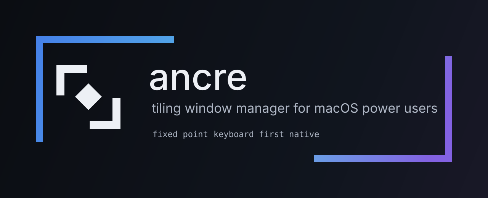

<p align="center">
  
</p>

# ancre

A Hyprland-inspired tiling window manager for macOS. Your windows arrange
themselves side by side — no overlapping, no hunting — and one key drives
everything. Built on the pure public Accessibility API: no private
CGS/SkyLight calls, no SIP changes, no kernel extensions.

> **ancre** /ɑ̃kʁ/ — French for *anchor*. Your windows stop drifting.

Inspired by [Hyprland](https://hypr.land) (layouts, ergonomics, the
one-modifier philosophy) and [OmniWM](https://github.com/wraithyy/OmniWM)
(proving a polished tiling WM on macOS is possible).

*New to tiling?* Instead of stacking windows on top of each other, a tiling
window manager gives every window its own slot in a layout and keeps the
screen fully used. You switch between numbered **workspaces** (virtual
desktops) and move focus with the keyboard.

## Highlights

- **Tiling layouts**: `dwindle` (Hyprland-style spiral), `scroll` (columns
  side by side), `stack` (monocle), plus **custom layouts** you describe in
  one line of config: `"master" = "h(0.6, *, v(0.5, *, *))"`.
- **Workspaces 1–9** spread across monitors with **stable assignment** —
  pin a workspace to a display by hardware id or name; unplug/replug and
  everything returns to where it belongs.
- **Workspace bar**: window icons per workspace, click to focus, drag icons
  between workspaces with a live drop preview, notification badges, context
  menus, fullscreen indicator. Lives at the top/bottom/left/right — or
  **inside the macOS menu bar**, or **hidden under the notch** (the camera
  cutout on recent MacBooks) and sliding out on hover.
- **One modifier for everything**: CapsLock becomes the *hyper* key — a
  modifier no app uses, so every shortcut is yours. Hold it a moment longer
  and a **cheatsheet overlay** shows every binding.
- **Mouse is a first-class citizen**: dragging a window natively (title bar,
  no modifier) routes through the tiling engine — edges insert, center
  swaps, a placeholder previews the target slot. Native resize live-adjusts
  the neighbors. `hyper+drag` / `hyper+right-drag` do the same from
  anywhere in the window.
- **Window switcher** (`hyper+space`): Spotlight-style fuzzy search over all
  windows, shows their workspace, Enter focuses.
- **Scratchpad** (`hyper+s`): your terminal (or any single configured app)
  drops in as a floating overlay and hides again — launches the app if
  needed.
- **Window hints** (`hyper+o`): letter overlays on every visible window,
  press the letter to focus.
- **Everything is themeable**: colors, opacities, fonts, sizes, paddings,
  radii — for the bar, focus border, drop preview, and help overlay.
- **Animations** with per-app opt-out for apps that animate badly.
- **AI ready**: a unix-socket command bus, the `ancrectl` CLI, a built-in
  **MCP server** (`ancrectl mcp`) and a Claude skill. An agent can read your
  window state and rearrange a whole setup in one declarative call.
- **English and Czech** UI, picked in config.

## Requirements

- macOS 14+ (Sonoma or newer), Apple Silicon or Intel
- Two permissions, requested on first launch with an onboarding screen:
  **Accessibility** (moving other apps' windows) and **Input Monitoring**
  (the hyper key and shortcuts)
- Building from source additionally needs the Xcode Command Line Tools
  (`xcode-select --install` in Terminal; includes git and Swift 6.0+)

## Before you launch — read this once

Starting ancre does two visible things immediately:

1. **CapsLock is remapped** to the hyper key (via `hidutil`). You get it
   back the moment ancre quits; if the process ever dies uncleanly, restore
   it with:
   ```sh
   hidutil property --set '{"UserKeyMapping":[]}'
   ```
2. **Your windows start tiling.** Press `hyper+p` to pause at any time, or
   click the ◱ icon in the menu bar (top-right strip of the screen) →
   *Pause tiling*.

The first launch shows an onboarding window first: it checks both
permissions, deep-links to the right System Settings panes (macOS's
Settings app), and only starts tiling after you press **Start**. Re-show it
anytime with `ancre --onboarding`.

## Install

### Homebrew (recommended)

```sh
brew tap wraithyy/tap
brew install --cask ancre        # installs ancre.app + puts ancrectl on PATH
open /Applications/ancre.app
```

### From source

Open Terminal (find it with Spotlight: `⌘+space`, type "Terminal") and run:

```sh
xcode-select --install                                # once: compiler toolchain + git
git clone https://github.com/wraithyy/ancre && cd ancre   # download the source
swift build -c release                                # compile (first run fetches TOMLKit; a few minutes)
Scripts/bundle.sh                                     # package .build/ancre.app
cp .build/release/ancrectl /usr/local/bin/            # optional: CLI on PATH
open .build/ancre.app                                 # launch (onboarding appears)
```

### Uninstall

1. Quit ancre (menu bar ◱ → Quit) — the CapsLock remap reverts
   automatically. If it didn't (crash): `hidutil property --set
   '{"UserKeyMapping":[]}'`.
2. Delete the app (`ancre.app`), plus config and data if you want a clean
   slate: `~/.config/ancre/` and `~/Library/Application Support/ancre/`.
3. Remove the two permissions in System Settings → Privacy & Security if
   you like. Your windows stay where they were.

## Default keybindings

Hyper = CapsLock (change the physical key via `[hyper].key`; `f13`–`f20`,
`right_cmd`, `right_option` also work). Hold hyper ~2 s → cheatsheet overlay
with every binding; using a shortcut resets the timer.

| Shortcut | Action |
|---|---|
| `hyper + h/j/k/l` | focus window left/down/up/right |
| `hyper + shift + h/j/k/l` | move window in direction (swaps places with the window there) |
| `hyper + arrows` | resize focused window — neighbors adjust |
| `hyper + 1…9` | switch workspace |
| `hyper + shift + 1…9` | send focused window to workspace |
| `hyper + space` | window switcher (fuzzy search) |
| `hyper + s` | scratchpad toggle |
| `hyper + o` | window hints (focus by letter) |
| `hyper + v` | toggle floating (window leaves the grid and moves freely) |
| `hyper + f` | toggle fullscreen |
| `hyper + t` / `hyper + shift + t` | layout scroll / dwindle |
| `hyper + a` | adopt frontmost window into current workspace |
| `hyper + p` | pause tiling (toggle) |
| `hyper + r` | retile — rescan windows and re-place everything |
| `hyper + ,` / `hyper + .` | focus previous / next monitor |

Example — Teams on the left, Mail on the right: focus Teams, `hyper+shift+h`
until it sits left; focus Mail (`hyper+l`), done. Want Calendar on its own
desktop: focus it, `hyper+shift+2`, and `hyper+2` / `hyper+1` switch back
and forth.

All of it is rebindable in `[keybindings]`; your entries merge with the
defaults and an empty string `""` unbinds a default. Any command from the
[request grammar](#scripting--ai-cli--mcp--skill) can be bound, including
`preset <name>`, `layout <custom>`, `open-config`, `switcher`, `hints`.
(`reload-config` is IPC/menu-only — it is not a bindable command.)

### Mouse

| Gesture | Effect |
|---|---|
| native drag (title bar) | tile follows your cursor through the layout: near an edge it **inserts** next to the target (placeholder shows the slot), over the center it **swaps** |
| native resize (window edge) | neighbors re-ratio live |
| `hyper + left-drag` | same move/insert/swap, grabbing the window anywhere |
| `hyper + right-drag` | resize from anywhere in the window |

### Bar

Click a workspace → switch. Click a window icon → focus it. Drag an icon to
another workspace cell → move the window (drop slot previewed). Right-click
an icon → float/tile, fullscreen, move-to-workspace submenu. Right-click a
workspace → layout picker, move focused window here. Dot badge = the app
wants attention. Dashed ring = floating window.

### Menu bar (◱)

The ◱ icon in the menu bar (the strip along the top of the screen, right
side): pause tiling (icon shows ◱✕ while paused), retile, monitor list
(click copies the stable id for config), open config, reload config, quit.
Everything here works without a terminal.

## Coming from Hyprland?

| Hyprland | ancre |
|---|---|
| `dwindle` layout | `dwindle` (same idea) |
| `master` layout | a `[custom-layouts]` template, e.g. `"master" = "h(0.6, *, v(0.5, *, *))"` |
| workspace rules (`workspace = 1, monitor:DP-1`) | `[workspaces]` — pin by stable id or name, with priority lists |
| `windowrulev2` by app | `[app-workspaces]` (bundle id → workspace) |
| special workspace | `[scratchpad]` — **one** configured app, not arbitrary windows |
| `hyprctl` / socket IPC | `ancrectl` / unix socket (line protocol + JSON) |
| `hyprctl dispatch` | `ancrectl <command>` |

Known gaps, stated plainly: **no window rules by title/regex** (only bundle
id), **no `exec-once`/autostart** section yet (use a LaunchAgent or Login
Item), **gaps are global** (no per-workspace gaps), scratchpad holds a
single app. Window animations cover ancre's own placement moves, not
arbitrary system animations.

## Configuration

`~/.config/ancre/ancre.toml`, created from defaults on first run. TOML is
an INI-like plain-text format — edit it with any text editor. The full
annotated catalog of every key lives in
[`Sources/Config/default.toml`](Sources/Config/default.toml). Apply changes
with **Reload config** in the menu bar menu or `ancrectl reload-config` —
no restart, and a config typo never crashes the app (it falls back to
defaults and logs a warning).

| Section | Controls |
|---|---|
| `[general]` | `gaps-inner/outer`, `animations` + `animation-duration-ms` + `animations-exclude` (bundle ids), `default-layout`, `language` (`"en"`/`"cs"`), `follow-native-focus`, `auto-stack` + `auto-stack-min-width`, `move-log` |
| `[hyper]` | physical hyper key (`caps_lock`, `f13`–`f20`, `right_cmd`, `right_option`) |
| `[keybindings]` | shortcut → command; merges with defaults, `""` unbinds |
| `[workspaces]` | workspace → monitor: stable id (`vendor:model:serial`, copy from the menu bar) or a name substring; also a **priority list** `"1" = ["PHL", "Built-in"]` — first connected match wins |
| `[workspace-labels]` | per workspace: `name`, `icon` (emoji), `show-number`, `hide-when-empty`, `layout` |
| `[app-workspaces]` | bundle id → workspace for new windows (an app's bundle id is its stable identifier, e.g. `com.google.Chrome`; `ancrectl state` shows them) |
| `[custom-layouts]` | template layouts: `h(ratio, …)` side-by-side, `v(ratio, …)` stacked, `*` window slot; extra windows stack into the last slot |
| `[theme]` | shared colors: `accent`, `background` (`#RRGGBB` / `#RRGGBBAA`) |
| `[bar]` | `enabled`, `position` (`top`/`bottom`/`left`/`right`/`menubar`/`notch`), `align`, `offset-x/y`, `height`, `notch-side`, `peek` + `idle-opacity` (bar hides or ghosts until hyper is held or hovered), colors (`background-color`, `accent-color`, `float-color`, `badge-color`), typography (`font-size`, `font-family`), metrics (`icon-size`, `spacing`, `cell-*`, `pill-*`, `ring-width`, `max-icons`), `opacity`, `active-opacity`, `inactive-icon-opacity` |
| `[bar-overrides.<matcher>]` | per-monitor overrides of any `[bar]` key; matcher = stable id, name substring, or `notch` for notched displays (specific matcher beats `notch` beats base) |
| `[border]` | focus border: `enabled`, `color`, `width`, `radius` |
| `[preview]` | drag&drop placeholder: `color`, `opacity` |
| `[help]` | cheatsheet: `enabled`, `delay-ms`, `opacity`, `font-size`, `columns`, `corner-radius` |
| `[scratchpad]` | `app` (bundle id), `width`, `height` (fractions of the screen) |

### Vertical bars, menubar mode, notch mode

`left`/`right` render workspaces vertically (number above stacked icons).
`menubar` puts the pill *inside* the system menu bar band — no tiling space
lost; on a notched display it sits beside the notch (`notch-side`). `notch`
hides the bar entirely; move the cursor into the notch (or hold hyper) and
the pill slides out beneath it.

### Multi-monitor behavior

Monitors get hardware-stable ids (`vendor:model:serial`) that survive
replugs and reboots — CGDirectDisplayIDs don't. Workspace placement is a
pure function of (names, config, connected monitors), so disconnecting a
display migrates its workspaces to a connected one and replugging restores
the exact previous arrangement. If a migrated workspace doesn't fit
(too many windows for the monitor's width), **auto-stack** temporarily
switches it to the stack layout and back when space returns.

### Learning your habits

With `move-log = true` (default), every manual window move is logged as
one JSON line (bundle id + source/target workspace, **no window titles**) to
`~/Library/Application Support/ancre/move-log.jsonl`. Feed the file to an
agent and ask it to propose `[app-workspaces]` rules that match how you
actually sort your windows.

## Scripting & AI (CLI · MCP · skill)

Every feature goes through one command bus, exposed on a unix socket at
`~/Library/Application Support/ancre/ancre.sock` (mode 0600 — only your
user can drive it).

### CLI

`ancrectl` is on PATH with the Homebrew install; from source it lands in
`.build/release/ancrectl` (or `.build/debug/` after a plain `swift build`) —
copy it to `/usr/local/bin` or call it by path.

```sh
ancrectl state                 # JSON: monitors, workspaces, windows (id, title, bundle, floating, focused)
ancrectl workspace 3           # any command from the keybinding grammar
ancrectl layout scroll
ancrectl move-window 4495 8    # targeted verbs: move-window / focus-window / set-floating <id>
ancrectl preset-save review    # save the current arrangement…
ancrectl preset review         # …and restore it later
ancrectl arrange '{"layouts":{"2":"scroll"},"apps":{"com.google.Chrome":"2"},"windows":{"4495":"3"},"active":["1"],"focus":4495}'
ancrectl subscribe             # stream JSON events (one per line) until disconnect
ancrectl reload-config
```

Responses: `ok`, `error: …` (exit 1; exit 2 = usage error), or JSON.
`arrange` applies a whole setup declaratively in one call: per-workspace
layouts, app placement, individual window placement, active workspaces, and
final focus. The full request grammar (every command and verb) is in
[`.claude/skills/ancre/SKILL.md`](.claude/skills/ancre/SKILL.md).

### MCP server (built in — no Node, no repo checkout)

```sh
claude mcp add ancre --scope user -- ancrectl mcp
# from a source build, use the full path instead:
# claude mcp add ancre --scope user -- /path/to/repo/.build/release/ancrectl mcp
```

Tools: `ancre_state`, `ancre_command`, `ancre_arrange`,
`ancre_move_window`, `ancre_focus_window`, `ancre_set_floating`. An agent
can fulfill "set up my review workspace" by reading state, finding windows
by title/bundle id, and issuing one `ancre_arrange`.

## Architecture

Command bus: everything (hotkeys, bar, mouse, IPC) → `Command` →
`WM.dispatch(state:)` → `[Effect]` → the AX layer executes. One path per
operation, no side doors.

| Module | Role |
|---|---|
| `WMCore` | pure state + reducer; no AX/AppKit imports, fully unit-tested |
| `LayoutEngine` | dwindle / columns / stack / template layouts — stateless value types |
| `AXBridge` | AXObserver plumbing, window tracking, display management, offscreen parking |
| `InputSystem` | hidutil remap + CGEventTap, decoupled from WMCore |
| `Animator` | animated frame application with per-app latency fallback |
| `Bar` | SwiftUI bar + overlays, localization |
| `Config` | TOML schema, validation with warnings (never crashes on a typo) |
| `App` | glue: controller, IPC server, menu bar, onboarding |

Key invariant: all WM state lives on a single dispatch queue (`axQueue`).
Hidden workspaces are "parked" just past the edge of the display union —
macOS offers no public API to truly hide another app's window.

Contributor docs: [CONTRIBUTING.md](CONTRIBUTING.md) ·
[CLAUDE.md](CLAUDE.md) · [docs/PLAN.md](docs/PLAN.md) ·
documentation website source in [`website/`](website/) ·
brand assets in [`docs/brand/`](docs/brand/).

```sh
swift build && swift test    # 63 unit tests over WMCore/LayoutEngine/Config
```

## Troubleshooting

No terminal needed for the first three — the menu bar ◱ icon and hyper keys
cover them:

- **Windows aren't tiling** → `hyper+r`, or menu bar ◱ → *Retile*. Typical
  after logging in with the screen locked.
- **A window "disappeared"** → it is parked or floating; the bar shows it
  (dashed ring = floating), right-click → Focus. Or `hyper+space` and type
  its name.
- **Everything should stop for a while** → `hyper+p` or ◱ → *Pause tiling*.
- **A window keeps popping back to the wrong size** → some windows enforce
  their own size; after 3 refused attempts ancre floats them automatically
  and retries on the next retile.
- **CapsLock stuck after a crash** → in Terminal (or send this line to
  whoever installed ancre for you):
  `hidutil property --set '{"UserKeyMapping":[]}'`
- **Nothing reacts to hyper at all** → check Input Monitoring permission;
  macOS silently kills event taps without it.
- **Digging deeper**: ancre logs to the system log; view live with
  `log stream --predicate 'process == "ancre"'`.

## License

[MIT](LICENSE)
